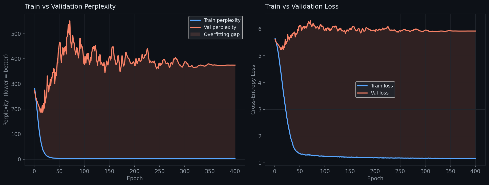
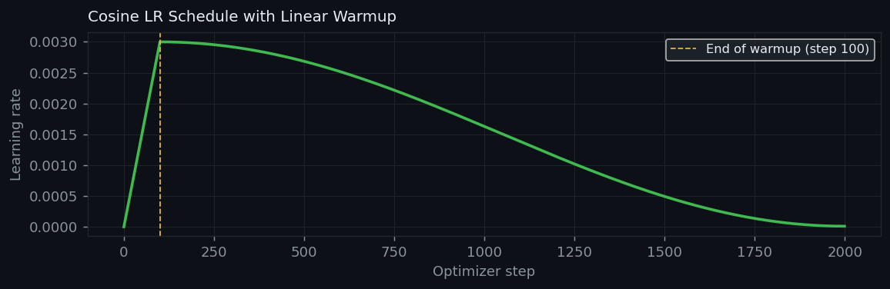
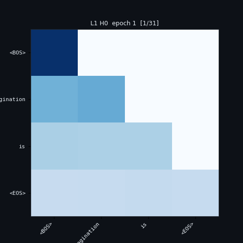

# mini-gpt

> A small GPT-style language model trained on Albert Einstein quotes.
> Step 4 of the mini-LLM series.


---

## Series

| Step | Repository | What it builds |
|------|-----------|----------------|
| 1 | [mini-embedding](../mini-embedding) | Word vectors — Skip-gram Word2Vec |
| 2 | [mini-self-attention](../mini-self-attention) | Multi-head self-attention encoder block |
| 3 | [mini-transformer](../mini-transformer) | Positional encoding + stacked causal decoder |
| **4** | **mini-gpt** ← you are here | Full LM on real text — overfitting, generation, evaluation |
| 5 | mini-chat _(coming)_ | Prompt → response, instruction following, larger dataset |

---

## What this adds over mini-transformer

| Feature | mini-transformer | mini-gpt |
|---|---|---|
| Corpus | 10 toy sentences | 50 Einstein quotes (real text) |
| Positional encoding | sinusoidal (fixed) | **learned** (`nn.Embedding`) |
| Train/val split | ✗ | ✓ 80 / 20 |
| Validation perplexity | ✗ | ✓ tracked every epoch |
| Overfitting visualisation | ✗ | ✓ train vs val curves + shaded gap |
| LR schedule | linear warmup + constant | **cosine decay** after warmup |
| Optimizer | Adam | **AdamW** (weight decay = 0.1) |
| Sampling | greedy / temp / top-k | + **top-p (nucleus)** |
| Generation | autoregressive | + **beam search** |
| Checkpoint saving | single file | best val-ppl checkpoint |

---

## What you will observe

### Overfitting
With 50 sentences and ~40K parameters, the model will memorise the training
data. You will see this clearly in `outputs/overfitting.png`:

```
Train perplexity: keeps falling toward 1
Val   perplexity: falls for a while, then flattens or rises
                  ↑ this gap is overfitting
```

This is not a bug — it is the expected and educational outcome on a tiny
corpus. `mini-chat` will fix it with a larger dataset.



### Generation quality
Because the model memorises training sentences, greedy generation will often
reproduce exact Einstein quotes. Temperature and nucleus sampling add
variation. Beam search produces the most coherent completions.

```
[greedy]
  prompt: "imagination is"
  output: "imagination is more important than knowledge"

[temp=0.8, top_k=10]
  prompt: "life is"
  output: "life is like riding a bicycle to keep moving"

[beam=3]
  prompt: "the secret to"
  output: "the secret to creativity is knowing how to hide your sources"
```

---

## Architecture

Identical to mini-transformer with two upgrades:

```
token indices  (batch, seq_len)
      │
      ▼
┌──────────────────────────────────────────┐
│  nn.Embedding  (vocab → emb_dim)         │  token embeddings
└──────────────────────────────────────────┘
      +
┌──────────────────────────────────────────┐
│  nn.Embedding  (max_len → emb_dim)       │  ← LEARNED positional embeddings
└──────────────────────────────────────────┘
      │  dropout
      ▼
   × N_LAYERS
┌──────────────────────────────────────────┐
│  LayerNorm                               │
│  MultiHeadAttention  (causal mask)       │
│  + residual + dropout                    │
│  LayerNorm                               │
│  FeedForward  (GELU)                     │
│  + residual + dropout                    │
└──────────────────────────────────────────┘
      │
      ▼
┌──────────────────────────────────────────┐
│  LayerNorm  (final)                      │
│  Linear  → vocab logits                  │  weight-tied to token embedding
└──────────────────────────────────────────┘
```

---

## Project structure

```
mini-gpt/
│
├── data/
│   └── einstein.txt            # 50 Albert Einstein quotes
│
├── src/
│   ├── tokenizer.py            # vocab + 80/20 train/val split + <UNK>
│   ├── attention.py            # scaled dot-product + multi-head attention
│   ├── model.py                # MiniGPT: learned PE + top-p + beam search
│   ├── dataset.py              # CausalDataset (BOS/EOS wrapped)
│   ├── train.py                # cosine LR decay + val perplexity + checkpointing
│   ├── utils.py                # generate_text, beam_search, interactive_generate
│   └── visualize.py            # overfitting plot, attention heatmap, LR curve
│
├── outputs/                    # saved model + all plots
├── main.py
├── environment.yml
├── requirements.txt
├── THEORY.md
└── README.md
```

---

## Quickstart

```bash
git clone https://github.com/your-username/mini-gpt.git
cd mini-gpt
conda env create -f environment.yml
conda activate mini-gpt
python main.py
```

Training takes **2–4 minutes on CPU**, under 30 seconds on GPU.

---

## Configuration

| Parameter | Default | Notes |
|---|---|---|
| `EMB_DIM` | `64` | Larger than mini-transformer |
| `N_HEADS` | `4` | head_dim = 16 |
| `N_LAYERS` | `4` | Four stacked blocks |
| `FF_DIM` | `128` | 2 × EMB_DIM |
| `MAX_LEN` | `64` | Max sequence length |
| `EPOCHS` | `400` | More epochs = more overfitting signal |
| `LR` | `3e-3` | Peak LR before cosine decay |
| `MIN_LR` | `1e-5` | LR floor at end of training |
| `WARMUP_STEPS` | `100` | Linear warmup duration |
| `VAL_SPLIT` | `0.2` | 20% of sentences held out |

---

## Outputs

| File | Description |
|---|---|
| `minigpt_best.pt` | Best checkpoint (lowest val perplexity) + config dict |
| `overfitting.png` | **Train vs val perplexity + loss — the key plot** |
| `lr_schedule.png` | Cosine LR schedule visualisation |
| `attention.png` | All layers × all heads for `INSPECT_PROMPT` |
| `attention_animation.gif` | Layer 1 Head 0 attention evolving during training |





---

## Interactive generation

After training, `main.py` opens a generation prompt:

```
  Prompt: imagination --greedy
  → imagination is more important than knowledge

  Prompt: life is --temp=0.8 --topk=10
  → life is like riding a bicycle to keep your balance

  Prompt: the true --topp=0.9
  → the true sign of intelligence is not knowledge but imagination

  Prompt: knowledge --beam=3
  → knowledge is limited but imagination encircles the world

  Prompt: i have --n=8
  → i have no special talent i am only
```

Flags: `--greedy`, `--temp=<float>`, `--topk=<int>`, `--topp=<float>`, `--beam=<int>`, `--n=<int>`

---

## Deep dive

See [`THEORY.md`](./THEORY.md) for the full explanation of:

- Train/val splits and why they matter
- What perplexity measures and how to read the overfitting plot
- Learned vs sinusoidal positional embeddings — trade-offs
- Cosine LR decay — why it outperforms constant LR
- AdamW vs Adam — weight decay and why it helps
- Top-p (nucleus) sampling — how it adapts to model confidence
- Beam search — how it works and when to use it vs sampling
- Line-by-line code walkthrough
- What mini-chat will add on top of this

---

## References

- Radford et al. (2018) — [GPT: Improving Language Understanding by Generative Pre-Training](https://openai.com/research/language-unsupervised)
- Radford et al. (2019) — [GPT-2: Language Models are Unsupervised Multitask Learners](https://openai.com/research/gpt-2-1-5b-released)
- Loshchilov & Hutter (2019) — [Decoupled Weight Decay Regularisation (AdamW)](https://arxiv.org/abs/1711.05101)
- Holtzman et al. (2020) — [The Curious Case of Neural Text Degeneration (top-p)](https://arxiv.org/abs/1904.09751)

---

## License

MIT
